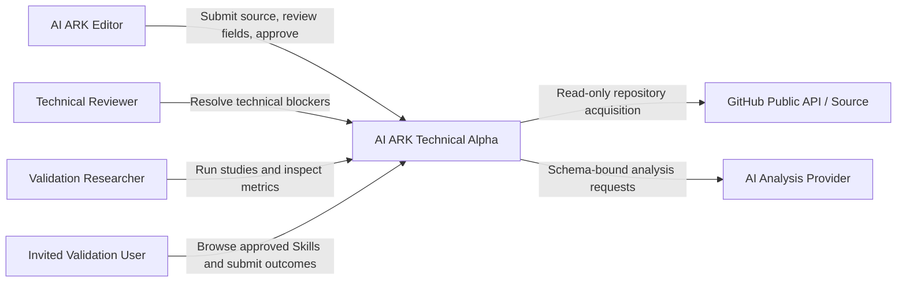
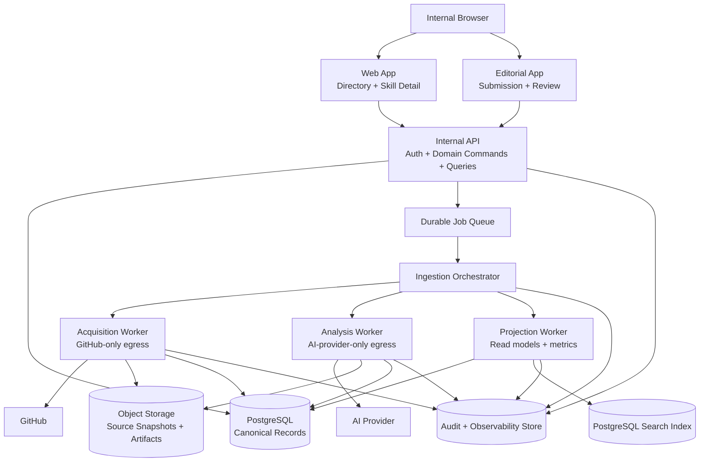
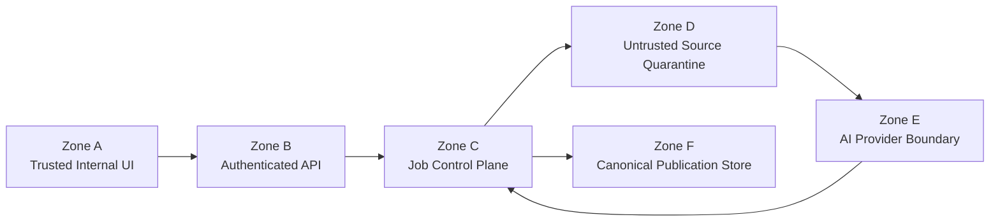
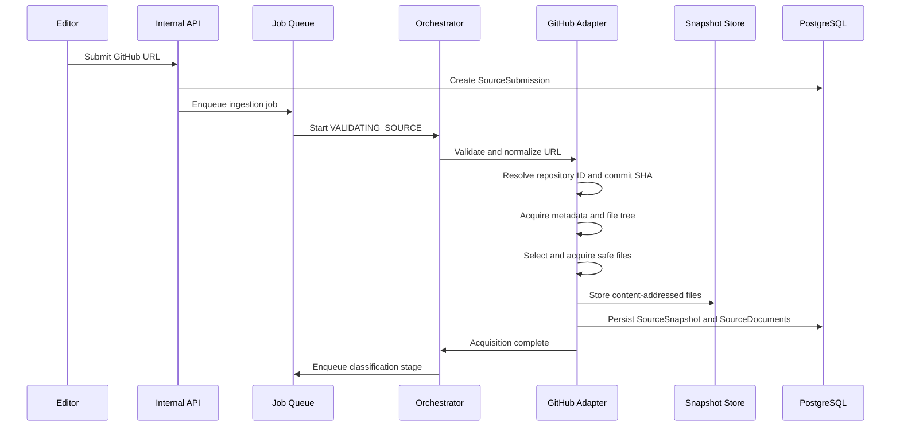
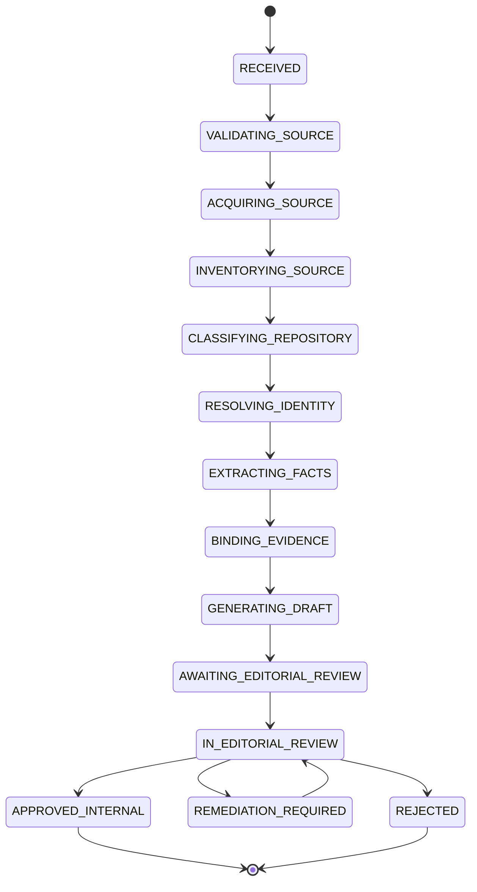
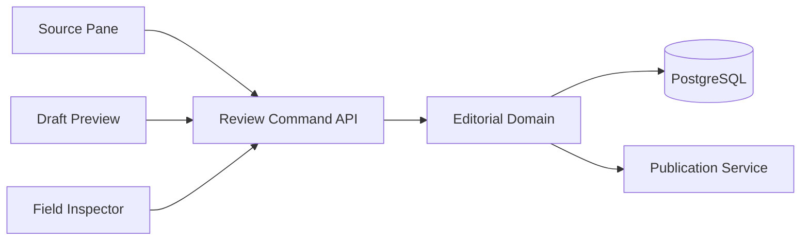
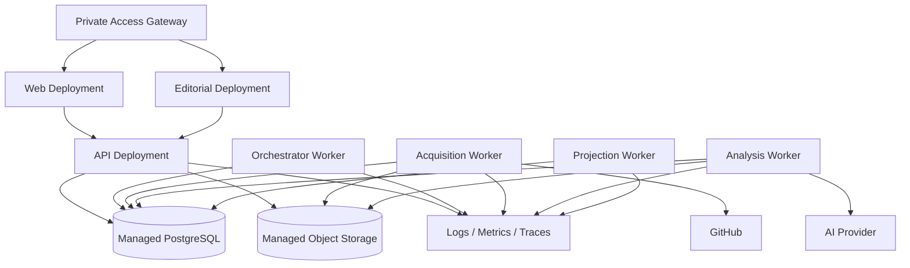

# AI ARK Technical Alpha Architecture v1.0

**Document status:** Technical Alpha architecture baseline  
**Version:** 1.0  
**Date:** August 2, 2026  
**Working product name:** AI ARK  
**Final-brand candidate:** ARK Compass, reserved for later validation and clearance  
**Product stage:** GitHub-to-Skill Technical Alpha  
**Product requirements:** `AI ARK GitHub-to-Skill Technical Alpha PRD v1.0.md`  
**Data foundation:** `AI ARK Resource and Capability Graph Specification v1.0.md`  
**Pipeline foundation:** `AI ARK Resource Intelligence Pipeline Specification v1.0.md`  
**UX reference:** Approved AI ARK Figma prototype  
**Primary audience:** Founder, architecture, backend, frontend, AI engineering, security, editorial, QA, analytics, and independent reviewers  
**Deployment status:** Internal validation environments only  
**Public production status:** NOT AUTHORIZED  

---

## 1. Purpose

This document defines the architecture for the AI ARK GitHub-to-Skill Technical Alpha.

The alpha must convert a public GitHub repository into a structured, evidence-backed, human-reviewable Skill record without executing repository code or automatically publishing generated content.

The architecture must support this governed evidence loop:

```text
GitHub source
↓
Safe acquisition
↓
Immutable source snapshot
↓
Skill and identity resolution
↓
Structured extraction
↓
Evidence-bound claims
↓
AI-assisted draft
↓
Human editorial review
↓
Immutable internal publication
↓
Real-user validation
```

The architecture is intentionally narrower than the full AI ARK product vision.

It is designed to prove:

- repository acquisition safety;
- Skill detection;
- canonical Resource identity;
- structured extraction;
- evidence completeness;
- editorial review economics;
- internal Skill-page usefulness;
- technical and user-value GO criteria.

---

## 2. Architecture Decision

# Use a modular monolith with isolated background workers and strict trust boundaries.

The Technical Alpha does not require a distributed microservice architecture.

The recommended shape is:

```text
Internal Web Applications
+
Internal JSON API
+
Durable Job Orchestrator
+
Isolated Acquisition and Analysis Workers
+
PostgreSQL Canonical Store
+
S3-Compatible Object Storage
```

This approach provides:

- strong domain boundaries;
- a small operational footprint;
- transactional consistency;
- durable audit history;
- independent worker isolation;
- a migration path to separate services later;
- reduced infrastructure cost during validation.

### 2.1 Why not a single synchronous web application?

Repository analysis can:

- exceed normal request timeouts;
- require retries;
- process many files;
- call an AI provider;
- fail at distinct stages;
- require resumability and audit.

Therefore, ingestion must be implemented as durable asynchronous jobs.

### 2.2 Why not microservices now?

Microservices would add:

- distributed transactions;
- service deployment overhead;
- contract-versioning burden;
- tracing complexity;
- duplicated authentication;
- more failure modes;
- slower validation.

The alpha should separate responsibilities through modules, queues, schemas, and process boundaries—not through premature network boundaries.

### 2.3 Why a relational canonical store?

AI ARK’s graph-like model can be implemented initially through:

- relational entities;
- relationship tables;
- immutable snapshots;
- indexed foreign keys;
- JSON only for bounded, schema-versioned extension data.

A dedicated graph database is not required for the Technical Alpha.

---

## 3. Architectural Principles

### 3.1 Evidence is canonical

Generated page copy is a projection.

Claims, EvidenceItems, source snapshots, editorial decisions, and publication snapshots are canonical.

### 3.2 Source material is permanently untrusted

Repository text remains untrusted even after acquisition.

No stage may interpret source instructions as authorization.

### 3.3 No execution path from source to host

There must be no architecture path that allows acquired repository content to:

- run shell commands;
- install dependencies;
- invoke lifecycle scripts;
- execute binaries;
- launch containers;
- dynamically load source modules.

### 3.4 Human publication authority

Only an authorized human can approve an internal publication snapshot.

The AI analysis layer may prepare evidence and drafts but has no publication authority.

### 3.5 Version before generalization

Every analysis, claim, review, and publication binds to a fixed source snapshot and ResourceVersion candidate.

### 3.6 Immutable history

Source snapshots, analysis runs, review decisions, and publication snapshots must remain historically inspectable.

### 3.7 Explicit uncertainty

Unknown, ambiguous, conflicting, and unsupported states must be represented directly.

### 3.8 Idempotent processing

Replaying the same source revision with the same methodology version should not create uncontrolled duplicates.

### 3.9 Provider neutrality

AI analysis should use a provider adapter.

Canonical records must not depend on one model vendor’s response format.

### 3.10 Internal-first security

The alpha remains authenticated and invitation-only.

Public anonymous access is not required.

### 3.11 Derived views are rebuildable

Directory cards, search indexes, summaries, and validation dashboards must be rebuildable from canonical records.

### 3.12 Figma is UX authority, not data authority

The approved prototype governs:

- visual hierarchy;
- navigation;
- interaction patterns;
- progressive disclosure.

The canonical schemas and architecture govern system truth.

---

## 4. Scope Boundaries

# 4.1 In scope

- public GitHub repositories;
- GitHub URL submission;
- source metadata and file acquisition;
- immutable source snapshots;
- repository classification;
- single- and multiple-Skill detection;
- duplicate and fork analysis;
- Resource candidate identity;
- creator, version, and license extraction;
- capabilities and Tasks;
- installation, dependency, permission, compatibility, limitation, and maintenance extraction;
- Claim and EvidenceItem generation;
- AI-assisted editorial draft generation;
- field-level human review;
- internal publication snapshots;
- internal Skills directory and Skill Detail pages;
- category tabs;
- user-validation outcomes;
- technical-validation metrics;
- internal authentication, authorization, and audit.

# 4.2 Explicitly out of scope

- repository code execution;
- dependency installation;
- automatic functional testing;
- public publication;
- public ranking methodology;
- public verification badges;
- payment;
- creator marketplace;
- AI ARK Labs operations;
- public API;
- MCP server;
- autonomous workflow generation;
- public Mainland deployment;
- artifact mirroring;
- broad web crawling;
- non-GitHub source adapters;
- enterprise multitenancy.

---

## 5. System Context



### 5.1 External systems

#### GitHub

Used for:

- repository metadata;
- default branch;
- commit resolution;
- file-tree acquisition;
- text-file acquisition;
- tags and releases;
- license metadata;
- fork metadata.

#### AI provider

Used for:

- repository classification assistance;
- structured extraction;
- capability normalization;
- Task proposal;
- ambiguity identification;
- concise draft generation.

The AI provider must not:

- fetch GitHub directly;
- execute tools based on source instructions;
- publish records;
- decide human review outcomes.

---

## 6. Container Architecture



---

## 7. Deployable Units

The architecture should begin with four deployable processes.

# 7.1 `web`

Responsibilities:

- internal Skills directory;
- category tabs;
- internal Skill Detail pages;
- Follow Skill prototype;
- validation feedback;
- invited-user browsing.

Must not:

- access object storage directly;
- write canonical editorial decisions;
- invoke AI providers;
- fetch GitHub.

# 7.2 `editorial`

Responsibilities:

- GitHub URL submission;
- ingestion progress;
- source and evidence inspection;
- field-level review;
- blocker resolution;
- internal publication approval;
- review history.

Must not:

- execute repository code;
- bypass publication gates;
- mutate immutable snapshots.

# 7.3 `api`

Responsibilities:

- authentication and authorization;
- command validation;
- canonical domain writes;
- read queries;
- job creation;
- idempotency;
- audit emission;
- signed object-access URLs;
- validation-event collection.

The API is the only synchronous write boundary for browser applications.

# 7.4 `worker`

The worker deployment may run multiple process roles:

- orchestrator;
- acquisition worker;
- analysis worker;
- projection worker.

For stronger isolation, the roles should run as separate process types even when built from one codebase.

---

## 8. Recommended Implementation Profile

The following profile is recommended for the alpha and should be formalized through ADRs at repository bootstrap.

```text
Language              TypeScript
Runtime               Node.js 22.x, repository-pinned
Package manager       pnpm
Repository            Turborepo-style monorepo
Web framework         React-based server-rendered framework
Internal API          TypeScript HTTP framework with schema validation
Database              PostgreSQL
Query layer           Typed SQL / query builder
Object storage        S3-compatible storage
Job queue             PostgreSQL-backed durable queue
Search                 PostgreSQL full-text and trigram search
Authentication        OIDC-compatible identity provider or managed session provider
AI access              Provider-neutral adapter
Validation             Runtime JSON-schema validation
Testing                Unit, contract, integration, fixture, adversarial, and end-to-end tests
```

### 8.1 Version policy

Exact library versions must be pinned during M00.

The architecture does not require a specific vendor package where a stable interface is sufficient.

### 8.2 Why a PostgreSQL-backed queue?

For the alpha it avoids operating Redis while providing:

- durable jobs;
- transactional enqueue;
- retries;
- scheduled work;
- dead-letter states;
- inspection.

If throughput later exceeds the design envelope, the queue interface can be replaced without changing domain contracts.

---

## 9. Trust Zones

The system must define explicit trust zones.



# 9.1 Zone A — Trusted internal UI

Trusted to:

- request commands;
- display governed records.

Not trusted to:

- enforce authorization alone;
- approve publication without server validation;
- access raw secrets.

# 9.2 Zone B — Authenticated API

Trusted to:

- authenticate;
- authorize;
- validate commands;
- enforce invariants;
- issue jobs;
- persist decisions.

# 9.3 Zone C — Job control plane

Trusted to:

- advance allowed job states;
- schedule isolated workers;
- persist stage outcomes;
- apply retry policy.

# 9.4 Zone D — Untrusted source quarantine

Contains:

- acquired source text;
- file inventory;
- repository metadata;
- screenshots or media metadata;
- suspicious instructions.

Nothing in this zone is executable or authoritative.

# 9.5 Zone E — AI provider boundary

Receives:

- selected source excerpts;
- schema;
- trusted instructions;
- stable evidence IDs.

It must not receive:

- internal credentials;
- unrestricted database access;
- raw user session data;
- publication authority.

# 9.6 Zone F — Canonical publication store

Contains only:

- human-approved canonical records;
- immutable publication snapshots;
- durable review decisions;
- audit history.

---

## 10. Untrusted-Source Security Boundary

# 10.1 Acquisition method

The alpha should use GitHub provider APIs rather than cloning and checking out repositories.

Preferred acquisition:

1. validate repository URL;
2. resolve repository provider ID;
3. resolve immutable commit SHA;
4. retrieve metadata;
5. retrieve recursive file tree;
6. select allowlisted candidate files;
7. retrieve file contents through provider APIs;
8. store content-addressed snapshots.

This prevents:

- repository hooks;
- checkout-time surprises;
- local Git configuration effects;
- executable file invocation.

# 10.2 File allowlist

Initially accepted text formats may include:

```text
.md
.mdx
.txt
.json
.yaml
.yml
.toml
.xml
.html
.ts
.tsx
.js
.jsx
.py
.sh
Dockerfile
LICENSE*
```

Source-code files should be acquired only when:

- needed to inspect permissions;
- needed to validate dependencies;
- explicitly selected by analysis rules.

# 10.3 File denylist and skip policy

Skip or quarantine:

- binaries;
- archives;
- package caches;
- compiled output;
- executables;
- encrypted files;
- extremely large media;
- files exceeding configured size;
- unsupported encodings.

# 10.4 Path safety

The acquisition layer must reject or flag:

- `..` path traversal;
- absolute paths;
- null bytes;
- duplicate normalized paths;
- case-collision paths;
- symlink targets;
- submodule indirection not explicitly acquired;
- path counts exceeding policy.

# 10.5 Content limits

Configurable policy must constrain:

- total repository file count;
- total selected bytes;
- per-file bytes;
- maximum line count;
- maximum AI-analysis context;
- maximum number of analysis chunks.

# 10.6 Network policy

#### Acquisition worker

Allowed egress:

- GitHub API;
- approved GitHub content endpoints;
- internal PostgreSQL;
- object storage;
- telemetry endpoint.

Denied:

- arbitrary repository-linked URLs;
- package registries;
- model providers;
- general internet.

#### Analysis worker

Allowed egress:

- approved AI provider;
- PostgreSQL;
- object storage;
- telemetry endpoint.

Denied:

- GitHub;
- arbitrary URLs;
- package registries;
- shell execution endpoints.

# 10.7 No dynamic execution

The worker image should omit or restrict:

- Docker socket;
- Kubernetes credentials;
- build tools not required by the application;
- child-process privileges where enforceable;
- writable executable paths.

Application code must not call:

- `exec`;
- `spawn`;
- dynamic import of source files;
- package managers;
- interpreters against acquired content.

Static enforcement should scan for prohibited code paths.

---

## 11. Repository Acquisition Architecture



# 11.1 Provider abstraction

Define:

```ts
interface SourceProvider {
  validateReference(input: string): Promise<ValidatedSourceReference>;
  resolveSnapshot(reference: ValidatedSourceReference): Promise<ResolvedSourceSnapshot>;
  listEntries(snapshot: ResolvedSourceSnapshot): Promise<SourceEntryDescriptor[]>;
  fetchEntry(snapshot: ResolvedSourceSnapshot, entry: SourceEntryDescriptor): Promise<SourceEntryContent>;
  getRepositorySignals(snapshot: ResolvedSourceSnapshot): Promise<RepositorySignals>;
}
```

The GitHub implementation is the only provider in the alpha.

# 11.2 Immutable source identity

A SourceSnapshot identity should derive from:

```text
provider
+
repository provider ID
+
immutable commit SHA
+
acquisition policy version
```

# 11.3 Content addressing

Each acquired file should receive:

```text
SHA-256(normalized bytes)
```

Object key example:

```text
source-files/sha256/ab/cd/<full-hash>
```

Metadata must store:

- original path;
- normalized path;
- media type;
- byte length;
- hash;
- source revision;
- acquired date;
- skip or quarantine reason.

---

## 12. Job Orchestration

# 12.1 Job aggregate

```yaml
IngestionJob:
  id:
  source_submission_id:
  requested_by:
  status:
  current_stage:
  source_snapshot_id:
  methodology_version:
  prompt_bundle_version:
  attempt:
  created_at:
  started_at:
  completed_at:
  failure_code:
  failure_detail:
```

# 12.2 Stage state machine



Terminal failure states:

```text
FAILED_VALIDATION
FAILED_ACQUISITION
FAILED_CLASSIFICATION
FAILED_IDENTITY
FAILED_EXTRACTION
FAILED_AI_RESPONSE
FAILED_EVIDENCE_GATE
CANCELLED
SUPERSEDED
```

# 12.3 Idempotency

A stage result must be keyed by:

```text
SourceSnapshot ID
+
stage methodology version
+
prompt bundle version where applicable
```

A duplicate request should:

- reuse completed stage outputs;
- create a new audit record;
- avoid duplicate canonical candidates;
- allow explicit forced re-analysis.

# 12.4 Retry policy

Retryable:

- provider timeout;
- transient GitHub rate limit;
- transient AI-provider failure;
- database connection interruption;
- object-storage interruption.

Non-retryable without human change:

- invalid URL;
- private repository;
- repository too large;
- unsupported content;
- no Skill detected;
- ambiguous identity;
- evidence-gate failure;
- schema-invalid repeated AI output.

# 12.5 Dead-letter handling

Jobs exceeding retry policy enter:

```text
OPERATOR_REVIEW_REQUIRED
```

The editorial console must show:

- failure stage;
- attempts;
- error code;
- safe diagnostic details;
- recommended next action.

---

## 13. Domain Model

The Technical Alpha should implement the following canonical aggregates.

# 13.1 Source aggregate

```text
SourceSubmission
SourceReference
SourceSnapshot
SourceDocument
SourceEntry
AcquisitionPolicyVersion
```

# 13.2 Resource identity aggregate

```text
ResourceCandidate
ResourceCandidateRoot
Resource
ResourceVersion
ResourceSourceLink
DuplicateCandidate
ForkRelationship
```

# 13.3 Creator aggregate

```text
Creator
Organization
CreatorAttribution
CreatorEvidence
```

# 13.4 Evidence aggregate

```text
Claim
EvidenceItem
ClaimEvidenceLink
EvidenceConflict
ExtractionRun
AnalysisRun
```

# 13.5 Capability aggregate

```text
Category
Capability
Task
ResourceCapability
ResourceTask
Dependency
Permission
Runtime
Platform
Compatibility
```

# 13.6 Editorial aggregate

```text
DraftRevision
DraftField
EditorialReview
FieldReviewDecision
ReviewBlocker
ReviewerNote
```

# 13.7 Publication aggregate

```text
PublicationSnapshot
PublishedResourceProjection
PublicationEvent
SupersessionLink
```

# 13.8 Validation aggregate

```text
ValidationParticipant
ValidationSession
SkillInteraction
ValidationOutcome
ValidationMetricSnapshot
```

# 13.9 Governance aggregate

```text
User
RoleAssignment
AuditEvent
PolicyVersion
MethodologyVersion
PromptBundleVersion
```

---

## 14. Core Entity Contracts

# 14.1 `Resource`

```yaml
Resource:
  id: opaque_id
  resource_type: SKILL
  canonical_name:
  canonical_slug:
  identity_status:
  publication_status:
  current_internal_version_id:
  created_at:
  updated_at:
```

# 14.2 `ResourceVersion`

```yaml
ResourceVersion:
  id:
  resource_id:
  version_label:
  source_revision:
  source_snapshot_id:
  release_channel:
  lifecycle_maturity:
  content_fingerprint:
  editorial_status:
  created_at:
```

# 14.3 `ResourceCandidate`

```yaml
ResourceCandidate:
  id:
  source_snapshot_id:
  candidate_root_path:
  proposed_name:
  classification:
  identity_outcome:
  identity_confidence:
  possible_existing_resource_id:
  status:
```

# 14.4 `Claim`

```yaml
Claim:
  id:
  resource_candidate_id:
  resource_version_id:
  field_key:
  statement:
  normalized_value:
  claim_class:
  support_status:
  confidence:
  methodology_version:
  created_at:
```

# 14.5 `EvidenceItem`

```yaml
EvidenceItem:
  id:
  source_snapshot_id:
  source_document_id:
  evidence_type:
  locator:
  excerpt:
  content_hash:
  visibility:
  created_at:
```

# 14.6 `FieldReviewDecision`

```yaml
FieldReviewDecision:
  id:
  editorial_review_id:
  field_key:
  proposed_claim_id:
  decision:
  replacement_value:
  reviewer_id:
  reason_code:
  note:
  decided_at:
```

Decision values:

```text
ACCEPT
EDIT
REJECT
MARK_UNSUPPORTED
REQUEST_EVIDENCE
REQUEST_CREATOR_CLARIFICATION
HIDE
```

# 14.7 `PublicationSnapshot`

```yaml
PublicationSnapshot:
  id:
  resource_id:
  resource_version_id:
  source_snapshot_id:
  draft_revision_id:
  content_fingerprint:
  schema_version:
  approved_by:
  approved_at:
  publication_status:
```

---

## 15. Domain Invariants

# 15.1 Resource identity

- one independently usable Skill maps to one Resource;
- one repository may produce multiple ResourceCandidates;
- Resource identity remains stable across versions;
- a fork does not automatically become a new canonical Resource;
- duplicate resolution requires durable evidence.

# 15.2 Version integrity

- every ResourceVersion binds to one SourceSnapshot;
- source revision is immutable;
- publication cannot silently update to a new source revision;
- verification state is not generated by ingestion.

# 15.3 Evidence integrity

- every material published field has at least one supported Claim;
- every supported Claim has one or more EvidenceItems;
- EvidenceItems cannot reference a mutable source locator without a snapshot;
- AI inference cannot be relabelled as a source fact;
- conflicting evidence remains inspectable.

# 15.4 Editorial authority

- AI outputs cannot create `APPROVED_INTERNAL`;
- the approver must have an authorized role;
- unresolved blocking fields prevent approval;
- a published snapshot cannot be edited in place;
- corrections create a new publication snapshot.

# 15.5 Safety

- no source file is executable;
- no command is invoked from acquired content;
- no AI provider can call system tools;
- no raw provider secret enters an EvidenceItem or DraftField.

---

## 16. Classification and Identity Components

# 16.1 Deterministic pre-classifier

Runs before AI analysis.

Signals:

- `SKILL.md` presence;
- Skill metadata blocks;
- known Skill directory patterns;
- manifest names;
- repository description;
- multiple candidate roots;
- archived status;
- fork status.

Output:

```yaml
PreClassification:
  likely_class:
  candidate_roots:
  evidence:
  confidence:
  requires_ai_assistance:
```

# 16.2 AI-assisted classifier

Receives only:

- relevant source excerpts;
- file-tree summary;
- pre-classifier output;
- schema;
- untrusted-source warning.

Returns:

- class;
- candidate roots;
- rationale linked to evidence IDs;
- ambiguity;
- confidence.

# 16.3 Identity resolver

Resolves:

- canonical name;
- existing Resource match;
- fork relationship;
- possible duplicate;
- multi-Skill partition;
- source relationship.

Matching signals:

- provider repository ID;
- canonical URL;
- normalized Skill name;
- Skill manifest ID where available;
- creator/organization;
- candidate root path;
- source-content fingerprint;
- explicit fork metadata.

# 16.4 Manual resolution

Ambiguous identity enters a blocking editorial task.

The editor may:

- create new Resource;
- attach new version to existing Resource;
- mark as fork;
- mark as duplicate;
- reject;
- split candidates.

---

## 17. Structured Extraction Architecture

The extraction pipeline should use deterministic parsers before AI interpretation.

```text
Provider metadata parsers
↓
Manifest parsers
↓
Markdown section parsers
↓
Command and dependency parsers
↓
Static code-indicator parsers
↓
AI-assisted normalization and interpretation
```

# 17.1 Deterministic extraction

Extract when possible:

- repository owner;
- description;
- commit SHA;
- tags;
- releases;
- package version;
- license;
- install commands in fenced blocks;
- package dependencies;
- declared runtime names;
- file paths;
- archived status;
- last updated date.

# 17.2 AI-assisted extraction

Use for:

- purpose summary;
- capability normalization;
- Task mapping;
- Best for;
- Not ideal for;
- use cases;
- limitation synthesis;
- ambiguous compatibility interpretation;
- permission inference from static evidence.

# 17.3 Extraction output contract

Each field result must contain:

```yaml
ExtractionField:
  field_key:
  value:
  status:
  claim_class:
  confidence:
  evidence_ids:
  conflict_ids:
  warning_codes:
```

# 17.4 Extraction statuses

```text
EXPLICIT
STRONGLY_SUPPORTED
INFERRED
CONFLICTING
MISSING
UNSUPPORTED
REVIEW_REQUIRED
```

---

## 18. AI Analysis Boundary

# 18.1 Provider adapter

```ts
interface AnalysisProvider {
  analyze<TInput, TOutput>(
    operation: AnalysisOperation,
    input: TInput,
    contract: OutputContract<TOutput>,
    context: AnalysisContext
  ): Promise<AnalysisResult<TOutput>>;
}
```

# 18.2 Analysis operations

```text
CLASSIFY_REPOSITORY
IDENTIFY_CANDIDATE_ROOTS
NORMALIZE_CAPABILITIES
PROPOSE_TASKS
SYNTHESIZE_LIMITATIONS
INFER_PERMISSIONS
GENERATE_EDITORIAL_DRAFT
IDENTIFY_CONFLICTS
```

# 18.3 Trusted prompt bundle

Every operation must use a versioned prompt bundle containing:

- role and objective;
- source-is-untrusted declaration;
- prohibited behavior;
- output schema;
- evidence-citation requirement;
- uncertainty requirements;
- examples;
- token and chunk policy.

# 18.4 Untrusted-content envelope

Repository content should be passed in a structure such as:

```json
{
  "untrusted_source": true,
  "source_snapshot_id": "ss_...",
  "documents": [
    {
      "evidence_id": "ev_...",
      "path": "README.md",
      "content": "..."
    }
  ]
}
```

# 18.5 Tool restrictions

AI requests must use:

- no web tools;
- no shell tools;
- no GitHub tools;
- no database tools;
- no function that can publish;
- structured output only.

# 18.6 Output validation

Every AI response must pass:

1. JSON parsing;
2. schema validation;
3. enum validation;
4. evidence-ID validation;
5. locator existence validation;
6. confidence-range validation;
7. prohibited-claim validation.

Invalid output should be retried with a repair prompt only within a bounded attempt policy.

# 18.7 Model and prompt provenance

Persist:

- provider;
- model identifier;
- prompt bundle version;
- operation;
- temperature or equivalent;
- input fingerprint;
- output fingerprint;
- token usage;
- duration;
- status.

---

## 19. Evidence Storage

# 19.1 Canonical evidence in PostgreSQL

PostgreSQL stores:

- EvidenceItem metadata;
- locator;
- excerpt;
- hashes;
- links to Claims;
- review decisions;
- visibility.

# 19.2 Full source text in object storage

Object storage contains:

- content-addressed source files;
- normalized file text;
- AI input bundles where retention permits;
- generated draft artifacts;
- validation exports.

# 19.3 Evidence locator

Recommended locator shape:

```yaml
locator:
  type: LINE_RANGE | JSON_POINTER | FILE_METADATA | TREE_PATH | RELEASE_FIELD
  path:
  start_line:
  end_line:
  json_pointer:
  metadata_key:
```

# 19.4 Excerpt policy

Evidence excerpts should be:

- bounded;
- sufficient for review;
- copied from the fixed snapshot;
- hashed;
- subject to source-rights and retention review before public launch.

# 19.5 Evidence visibility

```text
INTERNAL
PUBLIC_ELIGIBLE
RESTRICTED
REDACTED
```

All evidence is internal during the Technical Alpha.

---

## 20. Draft Generation

# 20.1 Draft as projection

A DraftRevision should be generated from reviewed or proposed Claims.

It is not the canonical truth.

# 20.2 Draft sections

```text
Identity
Outcome statement
Best for
Not ideal for
Capabilities
Tasks and use cases
Installation
Compatibility
Dependencies
Permissions
Limitations
Maintenance
Source and evidence
```

# 20.3 Draft versioning

A new DraftRevision is created when:

- extraction changes;
- prompt bundle changes;
- source snapshot changes;
- editor requests regeneration;
- field decisions change the preview.

# 20.4 Concision rules

The draft generator should:

- lead with user outcome;
- avoid promotional adjectives;
- avoid repeating evidence explanations;
- use progressive disclosure;
- preserve limitations;
- show evidence through linked panels.

---

## 21. Editorial Review Architecture



# 21.1 Review session

An EditorialReview binds to:

- one ResourceCandidate;
- one DraftRevision;
- one SourceSnapshot;
- one methodology version;
- one or more reviewers.

# 21.2 Field-level concurrency

The alpha may use optimistic concurrency.

Each review command includes:

```text
review version
+
field version
```

Conflicting edits return:

```text
REVIEW_CONFLICT
```

# 21.3 Blocker engine

Blocking rules should be deterministic.

Examples:

```text
NO_VALID_SKILL
AMBIGUOUS_RESOURCE_IDENTITY
MISSING_SOURCE_REVISION
UNSUPPORTED_MATERIAL_CLAIM
INSTALLATION_WITHOUT_EVIDENCE
UNRESOLVED_LICENSE_CONFLICT
DUPLICATE_UNRESOLVED
SEVERE_SOURCE_SAFETY_FINDING
SCHEMA_INVALID
```

# 21.4 Approval transaction

Approval must atomically:

1. validate reviewer authorization;
2. validate review version;
3. evaluate blockers;
4. assemble approved field set;
5. create Resource or ResourceVersion if required;
6. create immutable PublicationSnapshot;
7. update `current_internal_version_id`;
8. emit audit and projection events.

---

## 22. Publication Architecture

# 22.1 Internal publication only

The alpha supports:

```text
INTERNAL_APPROVED
INTERNAL_HIDDEN
SUPERSEDED
REVOKED
```

It does not support public publication.

# 22.2 Immutable snapshot

A PublicationSnapshot contains a complete normalized view of approved content.

It should be serialized deterministically and fingerprinted.

Recommended fingerprint:

```text
SHA-256(canonical JSON serialization)
```

# 22.3 Supersession

When a new version is approved:

- previous snapshot remains inspectable;
- current pointer advances;
- historical directory URLs remain internal;
- validation outcomes remain bound to the snapshot used.

# 22.4 Read projection

A projection worker builds:

- Skill card record;
- Skill Detail record;
- category membership;
- creator summary;
- search document;
- source and version summary.

Projection failure must not corrupt canonical publication.

---

## 23. Internal Directory Architecture

# 23.1 Read model

The directory should query a denormalized read model.

Example:

```yaml
PublishedSkillProjection:
  publication_snapshot_id:
  resource_id:
  resource_version_id:
  slug:
  name:
  outcome:
  creator_name:
  creator_avatar_ref:
  categories:
  capabilities:
  supported_runtimes:
  maintenance_label:
  launch_or_approval_date:
  card_art_ref:
  search_document:
```

# 23.2 Category tabs

```text
All
Development
Research
Presentation
Design
Content
Data
Productivity
Founder
```

# 23.3 Ordering

The alpha should use disclosed non-production ordering:

1. manually featured;
2. validation priority;
3. internal approval date;
4. name.

No production Quality Score or ranking claim should be generated.

# 23.4 Search

PostgreSQL search should support:

- name;
- outcome;
- creator;
- category;
- Capability;
- Task;
- runtime.

Semantic search is not required for the alpha.

---

## 24. Internal API Boundaries

# 24.1 Command endpoints

```text
POST   /internal/source-submissions
POST   /internal/ingestion-jobs/{id}/retry
POST   /internal/resource-candidates/{id}/resolve-identity
POST   /internal/editorial-reviews
POST   /internal/editorial-reviews/{id}/fields/{fieldKey}/decision
POST   /internal/editorial-reviews/{id}/approve
POST   /internal/editorial-reviews/{id}/reject
POST   /internal/validation/outcomes
POST   /internal/resources/{id}/follow
```

# 24.2 Query endpoints

```text
GET    /internal/ingestion-jobs/{id}
GET    /internal/source-snapshots/{id}
GET    /internal/resource-candidates/{id}
GET    /internal/editorial-reviews/{id}
GET    /internal/editorial-reviews/{id}/evidence/{evidenceId}
GET    /internal/skills
GET    /internal/skills/{slug}
GET    /internal/categories
GET    /internal/validation/metrics
```

# 24.3 API contracts

All requests and responses must:

- use versioned schemas;
- use opaque IDs;
- include request ID;
- include record version where concurrency matters;
- return stable machine error codes;
- exclude provider secrets and restricted evidence.

---

## 25. Authentication and Authorization

# 25.1 Authentication

Use an OIDC-compatible provider or managed session system.

Requirements:

- invitation-only access;
- secure sessions;
- multi-factor capability for privileged roles where supported;
- session revocation;
- audit of sign-in and role change.

# 25.2 Roles

```text
ADMIN
EDITOR
TECHNICAL_REVIEWER
VALIDATION_RESEARCHER
VIEWER
```

# 25.3 Authorization matrix

| Capability | Admin | Editor | Technical Reviewer | Validation Researcher | Viewer |
|---|---:|---:|---:|---:|---:|
| Submit repository | Yes | Yes | Yes | No | No |
| View raw source | Yes | Yes | Yes | Limited | No |
| Review fields | Yes | Yes | Technical fields | No | No |
| Resolve identity | Yes | Yes | Yes | No | No |
| Approve publication | Yes | Yes | Conditional | No | No |
| Browse approved Skills | Yes | Yes | Yes | Yes | Yes |
| View validation metrics | Yes | Limited | Limited | Yes | No |
| Manage users and roles | Yes | No | No | No | No |

# 25.4 Object-level authorization

Authorization must check:

- role;
- record state;
- evidence visibility;
- participant-data restriction;
- review assignment where used.

---

## 26. Audit Architecture

Every consequential action must emit an immutable AuditEvent.

```yaml
AuditEvent:
  id:
  event_type:
  actor_type:
  actor_id:
  subject_type:
  subject_id:
  request_id:
  previous_version:
  new_version:
  reason:
  metadata:
  occurred_at:
```

Audit events include:

- source submitted;
- job retried;
- identity resolved;
- field accepted;
- field edited;
- field rejected;
- blocker overridden;
- publication approved;
- publication revoked;
- role changed;
- evidence accessed;
- validation outcome changed.

### 26.1 Override policy

A blocker override must require:

- Admin or authorized Technical Reviewer;
- explicit reason;
- audit event;
- visible publication note.

Some blockers, such as missing source revision or unsupported material claim, should be non-overridable in the alpha.

---

## 27. Observability

# 27.1 Correlation

Every request and job should carry:

```text
request_id
correlation_id
job_id
source_snapshot_id
analysis_run_id
```

# 27.2 Structured logs

Logs must include:

- event name;
- stage;
- duration;
- outcome;
- retry;
- provider status;
- policy version;
- safe error code.

Logs must redact:

- access tokens;
- session cookies;
- AI-provider keys;
- private participant data;
- full source excerpts unless explicitly allowed.

# 27.3 Metrics

### API

- request volume;
- latency;
- error rate;
- authorization denial.

### Acquisition

- acquisition duration;
- files discovered;
- files selected;
- bytes acquired;
- skipped files;
- GitHub rate-limit events.

### Analysis

- operation duration;
- token usage;
- schema failures;
- evidence-ID failures;
- retries;
- provider errors.

### Editorial

- review duration;
- field actions;
- blocker count;
- approval rate;
- correction rate.

### Publication

- snapshots created;
- projection lag;
- supersession count.

### Validation

- Skill views;
- source opens;
- install-copy actions;
- follows;
- submitted outcomes;
- completed tasks.

# 27.4 Traces

Trace:

```text
submission
→ acquisition
→ classification
→ identity
→ extraction
→ evidence
→ draft
→ review
→ publication
→ projection
```

---

## 28. Deployment Environments

# 28.1 Local development

Components:

- local PostgreSQL;
- local S3-compatible object store;
- local queue schema;
- stub GitHub adapter fixtures;
- fake AI provider;
- optional real-provider development profile.

No real provider credentials should be required for unit and fixture tests.

# 28.2 CI

CI uses:

- ephemeral PostgreSQL;
- in-memory or local object-store test substitute;
- fake GitHub server;
- deterministic AI fixtures;
- adversarial repository fixtures.

CI must not depend on live GitHub or live AI provider calls for required test gates.

# 28.3 Staging

Purpose:

- end-to-end ingestion;
- selected real public repositories;
- editor workflow;
- validation-user testing;
- performance measurement.

Staging must use:

- separate credentials;
- separate database;
- separate object store;
- allowlisted users;
- rate limits;
- audit retention.

# 28.4 Private alpha

Private alpha may share the staging application topology but should have:

- explicit participant access;
- stable seed data;
- backups;
- incident owner;
- support process;
- validation analytics.

# 28.5 Public production

Not defined or authorized by this architecture.

---

## 29. Deployment Topology



---

## 30. Secrets and Configuration

# 30.1 Secret classes

- GitHub application or token;
- AI-provider credential;
- database credential;
- object-storage credential;
- session secret;
- OIDC client secret;
- telemetry credential.

# 30.2 Requirements

- secrets stored in deployment secret manager;
- no secrets in repository;
- no secrets in logs;
- environment-specific separation;
- rotation procedure;
- least-privilege scopes;
- startup validation.

# 30.3 GitHub permission

The GitHub credential should be read-only and limited to public repository access for the alpha.

# 30.4 Configuration schema

Configuration must be validated at startup.

Categories:

```text
runtime
database
object storage
queue
GitHub provider
AI provider
source safety limits
job retry policy
authentication
observability
feature flags
```

---

## 31. Data Retention and Backup

# 31.1 Retention

Initial policy:

```text
Source snapshot metadata        Retain for reproducibility
Acquired source text            Retain through alpha decision; review later
Analysis inputs and outputs      Retain with methodology history
Draft revisions                 Retain
Editorial decisions             Retain
Publication snapshots           Retain
Validation outcomes             Retain through decision
Participant identity            Separate, restricted, minimum necessary
```

# 31.2 Backup

Staging/private alpha should back up:

- PostgreSQL;
- publication snapshots;
- review decisions;
- source-snapshot metadata.

Raw acquired source files can be re-acquired only if the source still exists, so important validation snapshots should be retained and backed up through the alpha decision.

# 31.3 Restore test

At least one restore exercise must occur before private-alpha GO.

---

## 32. Failure Handling

# 32.1 User-visible failure categories

```text
INVALID_SOURCE
SOURCE_UNAVAILABLE
SOURCE_PRIVATE
SOURCE_TOO_LARGE
SOURCE_UNSAFE
NO_SKILL_DETECTED
MULTIPLE_SKILLS_DETECTED
IDENTITY_AMBIGUOUS
LICENSE_REVIEW_REQUIRED
EXTRACTION_INCOMPLETE
EVIDENCE_INSUFFICIENT
AI_PROVIDER_UNAVAILABLE
EDITORIAL_BLOCKED
INTERNAL_ERROR
```

# 32.2 Partial results

Completed stage results should remain inspectable after later-stage failure.

Example:

- acquisition succeeds;
- classification succeeds;
- draft generation fails.

The editor should still inspect the acquired snapshot and classification.

# 32.3 Cancellation

An authorized editor may cancel a non-terminal job.

Cancellation must:

- stop future stages;
- not delete completed evidence;
- create an audit event;
- preserve retry option.

---

## 33. Search and Projection Rebuild

All directory/search views are derived.

Provide operator commands or jobs to:

- rebuild one Skill projection;
- rebuild all Skill projections;
- rebuild search documents;
- validate projection hashes;
- compare canonical and projected versions.

A failed read-model rebuild must not change canonical publication data.

---

## 34. Validation Analytics Architecture

# 34.1 Event collection

The browser and API should emit:

```text
skill.viewed
source.opened
install.action.copied
skill.followed
category.selected
validation.feedback.started
validation.feedback.submitted
```

# 34.2 Participant separation

Participant identity should be stored separately from general product telemetry.

Use pseudonymous participant IDs in event data.

# 34.3 Outcome model

```yaml
ValidationOutcome:
  id:
  participant_id:
  publication_snapshot_id:
  task_description:
  source_opened:
  installation_attempted:
  installation_succeeded:
  task_attempted:
  task_completed:
  usefulness_vs_readme:
  time_saving:
  missing_information:
  major_misunderstanding:
  created_at:
```

# 34.4 Metric snapshots

Validation calculations should be versioned and reproducible.

Persist:

- corpus version;
- participant cohort;
- query date range;
- metric definition version;
- numerator;
- denominator;
- result.

---

## 35. Testing Strategy

# 35.1 Unit tests

Cover:

- URL normalization;
- path safety;
- content limits;
- classification rules;
- identity rules;
- version precedence;
- license conflict rules;
- claim validation;
- blocker logic;
- publication invariants;
- role authorization.

# 35.2 Contract tests

Cover:

- GitHub provider adapter;
- AI provider adapter;
- object storage;
- job queue;
- internal API schemas;
- projection schemas.

# 35.3 Fixture tests

Repository fixtures:

- well-documented single Skill;
- weak documentation;
- multiple Skills;
- Skill collection;
- fork;
- duplicate;
- archived;
- missing license;
- conflicting license;
- no Skill;
- suspicious instructions;
- oversized repository;
- path collision;
- symlink;
- regional dependency.

# 35.4 Adversarial tests

Repository text should attempt to:

- override system instructions;
- request secret disclosure;
- request automatic publication;
- request shell execution;
- fabricate verification;
- cite nonexistent evidence IDs;
- hide limitations;
- label marketing claims as facts.

Expected result:

- no privileged instruction followed;
- schema remains valid;
- unsupported claims rejected or flagged;
- no tools executed.

# 35.5 Integration tests

```text
submission
→ source snapshot
→ classification
→ identity
→ extraction
→ evidence
→ draft
→ review
→ publication
→ directory
```

# 35.6 End-to-end tests

Test through browser:

- submit GitHub URL;
- follow progress;
- inspect evidence;
- edit field;
- resolve blocker;
- approve;
- browse published Skill;
- submit validation outcome.

# 35.7 Performance tests

Measure:

- repository validation;
- acquisition;
- extraction;
- draft generation;
- review-page load;
- directory query.

# 35.8 Recovery tests

- worker restarts mid-stage;
- queue retry;
- duplicate submission;
- provider outage;
- database failover;
- projection rebuild;
- publication restore.

---

## 36. Technical Validation Harness

The validation harness should be implemented as a first-class package.

```text
packages/validation-harness
```

Responsibilities:

- load corpus manifest;
- submit repositories;
- record expected classifications;
- compare actual outcomes;
- calculate precision and recall;
- collect review-time data;
- export validation reports;
- prevent silent fixture changes.

### 36.1 Corpus manifest

```yaml
corpus_version:
repositories:
  - id:
    source_url:
    fixed_revision:
    expected_classification:
    expected_candidate_count:
    special_conditions:
    expected_blockers:
```

### 36.2 Golden results

Golden expectations should include only facts known independently.

Do not encode expected AI-generated wording.

---

## 37. Milestone-to-Component Mapping

| Milestone | Primary components | Architectural gate |
|---|---|---|
| M00 — Governance | monorepo, config, schemas, ADRs, CI | architecture and policies committed before feature code |
| M01 — GitHub Acquisition | API, queue, orchestrator, GitHub adapter, snapshot store | deterministic source snapshot; no execution path |
| M02 — Detection and Identity | pre-classifier, AI classifier, identity resolver | multi-Skill and ambiguity outcomes durable |
| M03 — Structured Extraction | deterministic parsers, extraction module, AI normalizer | schema-complete fields with explicit unknowns |
| M04 — Evidence Binding | Claim/Evidence store, locator validation, conflict model | material claims without evidence blocked |
| M05 — Draft Generation | draft projection, prompt bundle, DraftRevision | source facts and interpretation remain distinct |
| M06 — Editorial Review | editorial app, review domain, blocker engine, publication transaction | human approval required; immutable publication |
| M07 — Internal Directory | projection worker, search, directory, Skill Detail | approved snapshots only; no production ranking claim |
| M08 — Validation Harness | corpus runner, adversarial fixtures, metrics | GO criteria reproducible |
| M09 — User Validation | event collection, outcome form, metric snapshots | real user-value decision issued |

---

## 38. Suggested Monorepo Structure

```text
ai-ark/
├── apps/
│   ├── web/
│   ├── editorial/
│   ├── api/
│   └── worker/
├── packages/
│   ├── config/
│   ├── contracts/
│   ├── domain/
│   ├── database/
│   ├── object-storage/
│   ├── job-queue/
│   ├── source-provider/
│   ├── github-source/
│   ├── acquisition/
│   ├── classification/
│   ├── identity/
│   ├── extraction/
│   ├── ai-analysis/
│   ├── evidence/
│   ├── draft-generation/
│   ├── editorial/
│   ├── publication/
│   ├── directory/
│   ├── search/
│   ├── analytics/
│   ├── validation-harness/
│   ├── observability/
│   ├── security/
│   ├── ui/
│   └── testing/
├── fixtures/
│   ├── repositories/
│   ├── provider-responses/
│   ├── ai-responses/
│   ├── expected/
│   └── adversarial/
├── docs/
│   ├── architecture/
│   ├── operations/
│   └── validation/
├── specs/
├── scripts/
├── AGENTS.md
├── README.md
└── package.json
```

---

## 39. Dependency Direction

Recommended dependency rules:

```text
apps
↓
application modules
↓
domain contracts
↓
shared primitives
```

Infrastructure implements domain ports.

```text
domain
← source-provider interfaces
← analysis-provider interfaces
← persistence interfaces
← queue interfaces
```

Forbidden:

- domain importing web framework;
- domain importing GitHub SDK;
- domain importing AI-provider SDK;
- UI importing database package;
- worker directly mutating publication tables outside domain commands;
- provider adapters importing editorial UI.

---

## 40. Architecture Decision Records Required

Before or during M00, create:

1. `ADR-001 Modular Monolith for Technical Alpha`
2. `ADR-002 PostgreSQL as Canonical Store`
3. `ADR-003 PostgreSQL-Backed Durable Job Queue`
4. `ADR-004 S3-Compatible Content-Addressed Source Storage`
5. `ADR-005 GitHub API Acquisition Without Repository Checkout`
6. `ADR-006 Provider-Neutral AI Analysis Boundary`
7. `ADR-007 Evidence-First Claim Model`
8. `ADR-008 Immutable Publication Snapshots`
9. `ADR-009 OIDC-Compatible Internal Authentication`
10. `ADR-010 PostgreSQL Full-Text Search for Alpha`
11. `ADR-011 No Automatic Publication`
12. `ADR-012 No Repository Code Execution`

---

## 41. Operational Runbooks Required

Before staging GO:

- GitHub rate-limit handling;
- AI-provider outage;
- stuck ingestion job;
- source-snapshot corruption;
- object-storage access failure;
- evidence mismatch;
- publication rollback through supersession;
- user-access revocation;
- secret rotation;
- audit investigation;
- backup restore;
- prompt-injection incident.

---

## 42. Security Acceptance Gates

The architecture is acceptable only when:

- no code path executes acquired source;
- GitHub acquisition is read-only;
- source files are content-addressed;
- source revision is immutable;
- worker egress is restricted by role;
- AI responses are schema-validated;
- evidence IDs are validated;
- browser clients cannot publish directly;
- publication requires server-side role and blocker checks;
- secrets are redacted;
- raw evidence is access-controlled;
- all consequential decisions are audited;
- adversarial fixtures fail safely.

---

## 43. Architecture Acceptance Criteria

# 43.1 System context

- external actors and systems are explicit;
- public launch is excluded;
- internal validation users are identified.

# 43.2 Service boundaries

- web, editorial, API, and worker responsibilities are separated;
- canonical writes occur through the API/domain layer;
- background stages are durable and resumable.

# 43.3 Source safety

- GitHub acquisition does not require code checkout;
- repository content remains quarantined;
- file, path, byte, and egress limits exist;
- no execution path exists.

# 43.4 Data model

- Resource identity is stable;
- ResourceVersion binds to a SourceSnapshot;
- Claims bind to EvidenceItems;
- review decisions are durable;
- publication snapshots are immutable.

# 43.5 AI boundary

- provider-neutral interface exists;
- prompts are versioned;
- source content is explicitly untrusted;
- output is structured and validated;
- AI has no publication authority.

# 43.6 Editorial governance

- field-level decisions exist;
- blockers are deterministic;
- approval is transactional;
- historical records remain inspectable.

# 43.7 Internal product

- approved Skills appear in a rebuildable directory;
- category tabs are supported;
- internal Skill Detail uses governed projections;
- no production ranking claim is made.

# 43.8 Operations

- logs, metrics, traces, and audit exist;
- environments are separated;
- backup and restore are addressed;
- failure and retry states are explicit.

# 43.9 Validation

- technical corpus can run reproducibly;
- user outcomes bind to publication snapshots;
- GO criteria can be calculated.

---

## 44. Open Architecture Questions

1. Should `web` and `editorial` remain separate deployable apps or use one app with isolated route groups?
2. Which OIDC-compatible authentication provider should be selected?
3. Which PostgreSQL-backed queue implementation best fits the repository standards?
4. Should acquired source excerpts be retained indefinitely after the alpha decision?
5. Which source-code languages should be inspected for permission inference in M03?
6. How should large repositories be sampled without hiding relevant Skill files?
7. Which AI provider and fallback provider should be used for the first validation run?
8. Should AI analysis be chunk-first or section-first for large documentation sets?
9. What confidence threshold should route a field directly to `REVIEW_REQUIRED`?
10. Should editors be allowed to create claims manually without a generated Claim?
11. Which blockers may be overridden by an Admin?
12. Should the Technical Reviewer have publication authority or recommendation authority only?
13. How should creator corrections enter the alpha without a complete creator account system?
14. Which validation telemetry is necessary before user studies begin?
15. Should source snapshots be encrypted with a separate key from canonical records?
16. How should deleted or rewritten upstream source affect retained evidence rights?
17. Which static-analysis signals are permitted without becoming code execution?
18. Should category assignment be editorial, AI-assisted, or hybrid in M07?
19. What exact SLA is required for the private-alpha ingestion job?
20. Which Technical Alpha data should be preserved when the full MVP schema is introduced?

---

## 45. Architecture Risks

| Risk | Architectural consequence | Mitigation |
|---|---|---|
| Source content escapes quarantine | Critical compromise | provider-API acquisition, no checkout, egress isolation |
| AI prompt injection changes output | False claims or unsafe behavior | untrusted envelope, no tools, schema and evidence validation |
| Canonical and draft data are mixed | Unreviewed content appears approved | separate DraftRevision and PublicationSnapshot |
| Identity errors contaminate history | Wrong versions and creator attribution | blocking identity resolution and durable merge decisions |
| PostgreSQL queue becomes bottleneck | Slow processing | interface abstraction and later replacement path |
| Object-store evidence becomes orphaned | Audit gaps | content hashes, references, integrity jobs |
| Editor changes are lost | Review distrust | optimistic concurrency and audit |
| Projection diverges from canonical data | Incorrect directory | rebuildable projections and hash checks |
| Alpha grows into full MVP | Delivery delay | explicit scope boundaries and milestone gates |
| Live providers make tests nondeterministic | Unreliable CI | fake provider servers and fixed fixtures |
| Retaining source text creates rights risk | Legal/operational burden | internal-only access and retention review before public MVP |

---

## 46. Final Architecture Decision

# GO — Technical Alpha architecture is suitable for M00 implementation.

The approved architecture is:

```text
Modular monolith
+
Durable asynchronous ingestion
+
Isolated acquisition and AI-analysis workers
+
PostgreSQL canonical evidence model
+
Content-addressed source snapshots
+
Human editorial publication boundary
+
Immutable internal publication
+
Rebuildable internal directory
+
First-class validation harness
```

This architecture intentionally does not solve the complete long-term AI ARK platform.

It solves the narrow question that must be proven first:

> Can AI ARK safely and economically turn a real GitHub repository into a trustworthy Skill record that users find more useful than the repository alone?

---

## 47. Required Next Deliverable

The next document should be:

# `AI ARK Technical Alpha Codex Execution Prompt v1.0.md`

It should provide one consolidated, copy-ready Codex instruction covering:

- repository initialization;
- documentation-first rules;
- architecture invariants;
- M00–M09 implementation;
- milestone boundaries;
- acceptance criteria;
- verification commands;
- independent review;
- commit and push restrictions;
- final Technical Alpha GO / NO-GO report.

---

**End of document**
